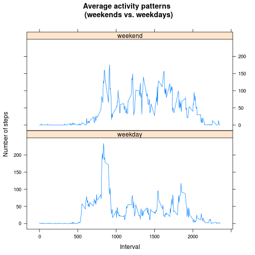

# Reproducible Research: Peer Assessment 1

## Loading and preprocessing the data
**IMPORTANT!** This step assumes that we unzipped activity.zip file to the same folder where our markdown file is located. Please set your working directory to this folder. It should contains 'activity.csv' data file

In this step we load the data and create two objects described below:

```r
act<-read.csv("activity.csv")
actv<-act[complete.cases(act$steps), ]
```

The following objects are produced:
- act  - data frame that resulted from loading the activity.csv file
- actv - transformed data frame that excludes NA values


## What is mean total number of steps taken per day?

We will use a vector (sumstepsperday) containing total number of steps for each day

```r
sumstepsperday<-tapply(actv$steps, actv$date, sum)
```

The following is the frequency distribution of the values representing total numbers of steps per day. Mean and the median values are shown below as well (ignoring NAs)

```r
hist(sumstepsperday, main="Histogram of steps/day distribution", xla="number of steps per day ", yla="number of days")
```

 

```r
mean(sumstepsperday, na.rm=T)
```

```
## [1] 10766
```

```r
median(sumstepsperday, na.rm=T)
```

```
## [1] 10765
```


## What is the average daily activity pattern?
First we calculate means of number of steps (avgstepspermin) for each 5-min interval across all days

```r
avgstepspermin<-aggregate(act$steps, list(act$interval), mean, na.rm=T)
names(avgstepspermin)<-c("intmin", "steps")
```

Below is the time series plot representing the average daily activity pattern:

```r
plot(avgstepspermin$intmin, avgstepspermin$steps, xlab="5-minute interval", ylab="avg number of steps taken", main="Average Daily Activity", type="l")
```

 

The following code finds the 5-min interval with most steps

```r
avgstepspermin[order(avgstepspermin$steps, decreasing=T),][1,]$intmin
```

```
## [1] 835
```

## Imputing missing values

First, we calculate the number of rows in the activity dataset with missing values:


```r
mvals <-subset(act, is.na(act$steps) == T | is.na(act$date) == T | is.na(act$interval) == T)
nrow(mvals)
```

```
## [1] 2304
```

Our strategy for filling in the missing values is to use the means for number of steps over the 5-min interval calculated in the previous task.
Here are the steps

1) clone the activity dataset object, as follows:

```r
act_p <- act
```

2) find index of all missing values in the cloned object (act_p)

```r
mi <- which(is.na(act_p)==TRUE)
```

3) replace all missing values for steps (by index) with the mean values for corresponding intervals from avgstepspermin data frame

```r
act_p[mi,]$steps <- ceiling(avgstepspermin[avgstepspermin$intmin == act_p[mi,]$interval, 2])
```

Let's re-plot the histogram and get mean, median and see the effect of the predicted missing values

```r
sumstepsperday_p<-tapply(act_p$steps, act_p$date, sum)
hist(sumstepsperday_p, main="Histogram of steps/day distribution\n (with imputed values)", xla="number of steps per day ", yla="number of days")
```

 

```r
mean(sumstepsperday_p, na.rm=T)
```

```
## [1] 10769
```

```r
median(sumstepsperday_p, na.rm=T)
```

```
## [1] 10837
```
CONCLUSION: The resulting mean and median values are slightly higher than those in the previous tasks (where we simply ignored the NAs). Comparing the values, we observe
that the effect of the imputed values on the median is higher than the effect on the mean


## Are there differences in activity patterns between weekdays and weekends?

To answer this question, we will use the dataset with filled in missing values (generated in the previous task). Let's convert the string dates to real dates, and then
use weekdays() function to create weekday/weekend factor variable (called weekend.f) in the dataset that will be used as a category in the lattice plot

```r
act_p$realdate <- as.Date(as.character(act_p$date), format="%Y-%m-%d")
act_p$weekday <- weekdays(act_p$realdate)
act_p$weekend.f <- "weekday"
act_p$weekend.f[act_p$weekday %in% c("Saturday", "Sunday")] <- "weekend"
```

Now we can create objects the represent averages of steps per minute intervals for weekdays and weekends, append weekend factor variable to each, and combine them into one that can be plotted, as follows:

```r
avgstepspermin_wdays <- aggregate(act_p$steps[act_p$weekend.f == "weekday"], list(act_p$interval[act_p$weekend.f == "weekday"]), mean, na.rm=T)
avgstepspermin_wends <- aggregate(act_p$steps[act_p$weekend.f == "weekend"], list(act_p$interval[act_p$weekend.f == "weekend"]), mean, na.rm=T)
names(avgstepspermin_wdays)<-c("intmin", "steps")
names(avgstepspermin_wends)<-c("intmin", "steps")
avgstepspermin_wdays$weekend.f<-"weekday"
avgstepspermin_wends$weekend.f<-"weekend"
avgstepspermin_alldays<-rbind(avgstepspermin_wdays, avgstepspermin_wends)
```

We're ready to plot our Average activity pattern graph

```r
library(lattice)
xyplot(steps ~ intmin | weekend.f, data = avgstepspermin_alldays, type="l", main="Average activity patterns \n (weekends vs. weekdays)", xlab="Interval", ylab="Number of steps", layout = c(1, 2))
```

 
